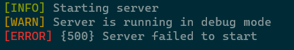
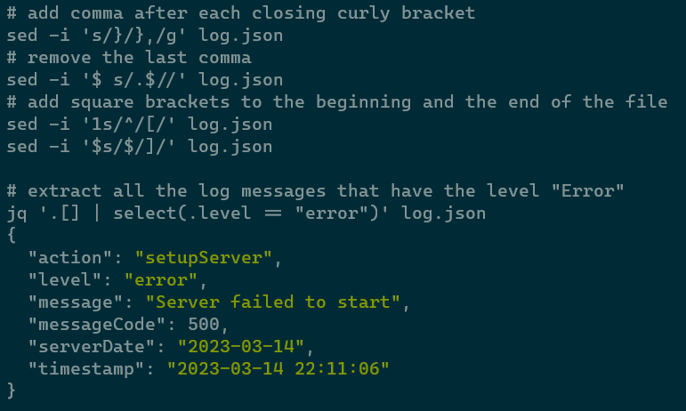

# CN_CHomeworks_1

- [CN\_CHomeworks\_1](#cn_chomeworks_1)
  - [Introduction](#introduction)
  - [Prerequisites](#prerequisites)
  - [Project Structure](#project-structure)
    - [Logger](#logger)
    - [Socket Wrapper](#socket-wrapper)
    - [DateTime](#datetime)
    - [Crypto](#crypto)
    - [JSON](#json)
    - [Client](#client)
      - [CLI](#cli)
    - [Server](#server)
      - [Authentication](#authentication)
      - [User](#user)
      - [Room](#room)
      - [Reservations](#reservations)
    - [API](#api)

## Introduction

This is a project for the Computer Networks course at the University of Tehran, Electrical and Computer Engineering department in Spring 2023.  
The project focuses on *Socket Programming* and is written in C++.  
The main goal of the project is to create a server for a hotel management system and a client for the users to interact with the server. We have named the hotel *Misasha Hotel* as it is the combination of [Misagh](https://github.com/MisaghM) and [Pasha](https://github.com/PashaBarahimi) which are the two members of the team.  
The project structure consists of several parts, each of which is explained in the following sections.

## Prerequisites

- [Crypto++](https://www.cryptopp.com/)  
  
  To install Crypto++ on Ubuntu, run the following command:  

  ```bash
  sudo apt install libcrypto++8 libcrypto++-dev
  ```

> The other libraries used in the project are included in the project files. These libraries are as follows:
> - [nlohmann/json](https://github.com/nlohmann/json)
> - [HowardHinnant/date](https://github.com/HowardHinnant/date)
> - [daniele77/cli](https://github.com/daniele77/cli)


## Project Structure

### Logger

A logger class that is used to log messages to the console or to a file. The following API is provided for the logger class:

```cpp
class Logger {
public:
    enum class Level {
        Info,
        Warning,
        Error
    };

    Logger(Level level);
    Logger(Level level, std::ofstream& file);

    void info(const std::string& message,
              const std::string& action = "",
              int messageCode = -1,
              const std::unordered_map<std::string, std::string>& details = {});
    void warn(const std::string& message,
              const std::string& action = "",
              int messageCode = -1,
              const std::unordered_map<std::string, std::string>& details = {});
    void error(const std::string& message,
               const std::string& action = "",
               int messageCode = -1,
               const std::unordered_map<std::string, std::string>& details = {});
};
```

The logger is able to differentiate between files and the console. Even if the `std::cout` is used to log to the console, but the output is redirected to a file, the logger will be able to detect the file which is done by using the `isatty()` function. This is useful because when the logger is used to log to a file, the output will be in JSON format, but when the logger is used to log to the console, the output will be in a human-readable and colored format.  
The logger is able to log the following information:

- **Level**: The level of the log message. It can be one of the following: `Info`, `Warning`, `Error`.
- **Message**: The message that is logged.
- **Action**: The action that is performed when the message is logged.
- **Message Code**: A code that is used to identify the message.
- **Details**: A map of key-value pairs that can be used to provide more information about the message.

Also, the logger will always include the following information in the log message:
- **Timestamp**: The timestamp of the log message.
- **Server Date**: The date of the server.

> It is important to note that the logger will log the above information only when the logger is used to log to a file. When the logger is used to log to the console, only the following information will be logged:  
> - **Level**
> - **Message**
> - **Message Code**

The following is an example of a log message that is logged to a file:

```json
{
    "action": "setupServer",
    "level": "info",
    "message": "Starting server",
    "serverDate": "2023-03-14",
    "timestamp": "2023-03-14 22:11:06"
}
{
    "action": "setupServer",
    "level": "warn",
    "message": "Server is running in debug mode",
    "serverDate": "2023-03-14",
    "timestamp": "2023-03-14 22:11:06"
}
{
    "action": "setupServer",
    "level": "error",
    "message": "Server failed to start",
    "messageCode": 500,
    "serverDate": "2023-03-14",
    "timestamp": "2023-03-14 22:11:06"
}
```

The following is an example of a log message that is logged to the console:



Logging to a file in JSON format is useful because we can use third-party tools such as [jq](https://stedolan.github.io/jq/) to parse the log file and extract the information that we need. For example, the following command can be used to extract all the log messages that have the level `Error`:

```bash
# add comma after each closing curly bracket
sed -i 's/}/},/g' log.json
# remove the last comma
sed -i '$ s/.$//' log.json
# add square brackets to the beginning and the end of the file
sed -i '1s/^/[/' log.json
sed -i '$s/$/]/' log.json

# extract all the log messages that have the level "Error"
jq '.[] | select(.level == "error")' log.json
```



### Socket Wrapper

### DateTime

DateTime is a static class that is used to get the current date and time. The following API is provided for the DateTime class:

```cpp
class DateTime {
public:
    static std::string getDateTime();
    static std::string getServerDate();

    static bool setServerDate(const std::string& date);
    static void increaseServerDate(int days = 1);

    static bool isValid(const std::string& date);
    static bool parse(const std::string& date, date::year_month_day& res);
    static int compare(const std::string& lhs, const std::string& rhs);
};
```

This class uses the [HowardHinnant/date](https://github.com/HowardHinnant/date) library to store the date in `date::year_month_day` struct. This library is added to `chrono` in C++20.  
It is important to note that all of the functions provided by the DateTime class require the date to be in the format `YYYY-MM-DD` which is the ISO 8601 format. This is different from the project requirements which require the date to be in the format `DD-MM-YYYY`.

### Crypto

The `crypto` namespace contains the following functions which are wrappers for the functions provided by the [Crypto++](https://www.cryptopp.com/) library:

```cpp
namespace crypto {

std::string SHA256(const std::string& input);
std::string base64Encode(const std::string& input);
std::string base64Decode(const std::string& encoded);

} // namespace crypto
```

The use cases for these functions are:

- **SHA256**: Used to hash the password of the user. The hashed password is stored in the JSON file instead of the plain text password to prevent the password from being stolen.
- **base64Encode**: Used to encode the password of the user before sending it to the server.
- **base64Decode**: Used to decode the password of the user after receiving it in the server.

### JSON

### Client

#### CLI

### Server

#### Authentication

#### User

#### Room

#### Reservations

### API
