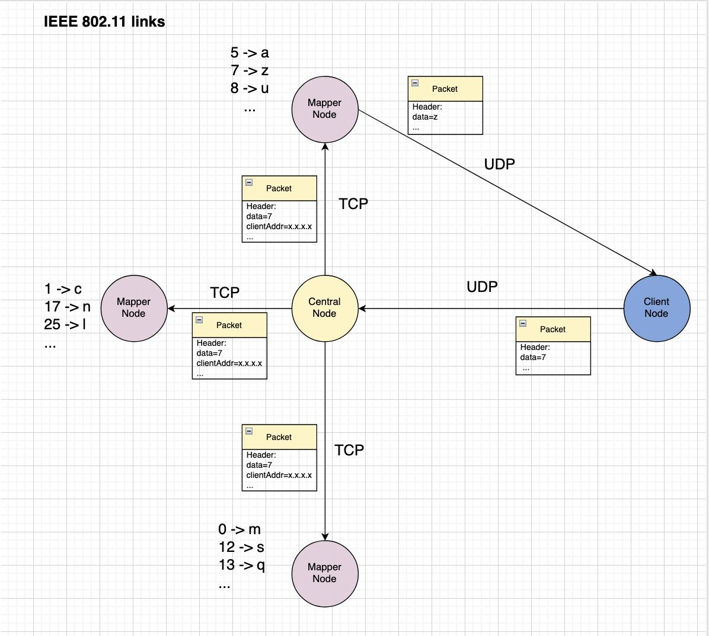
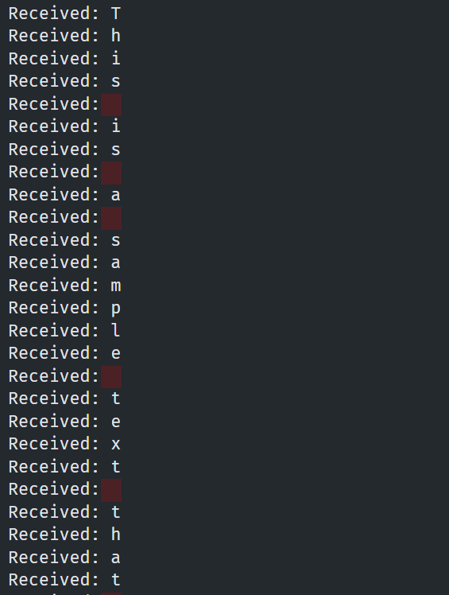
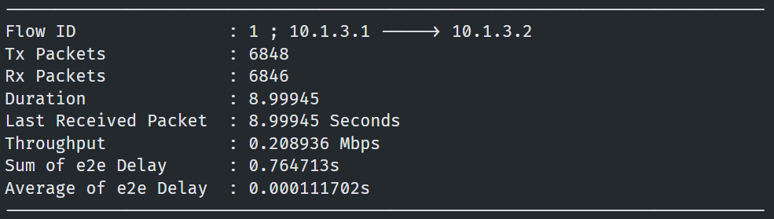
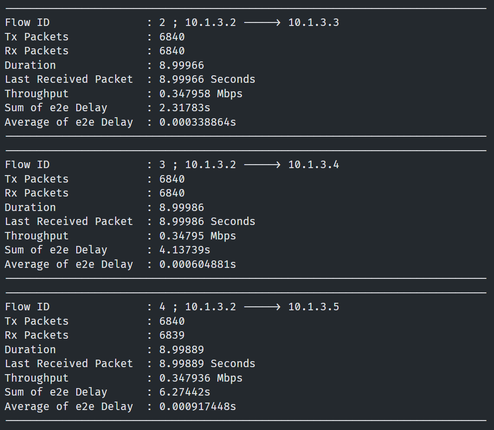
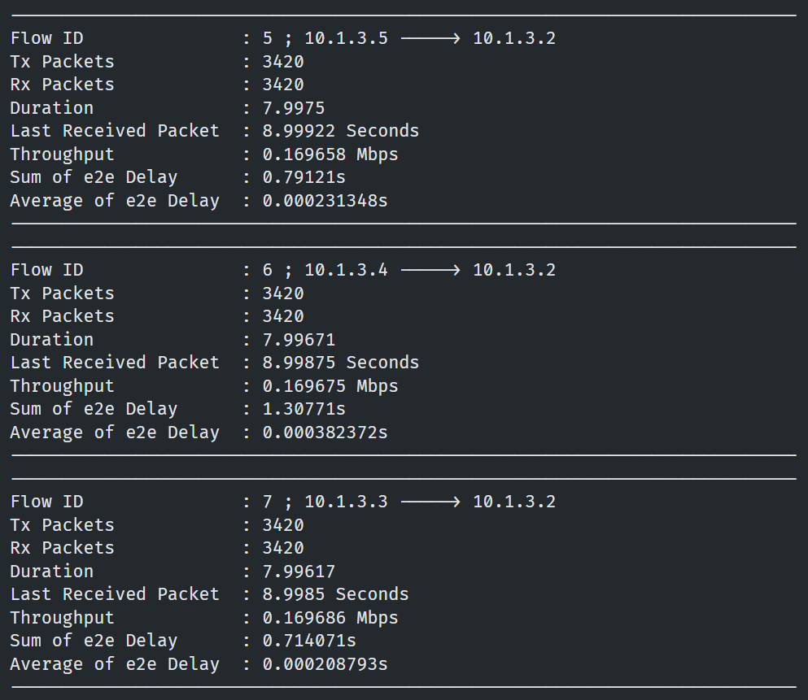
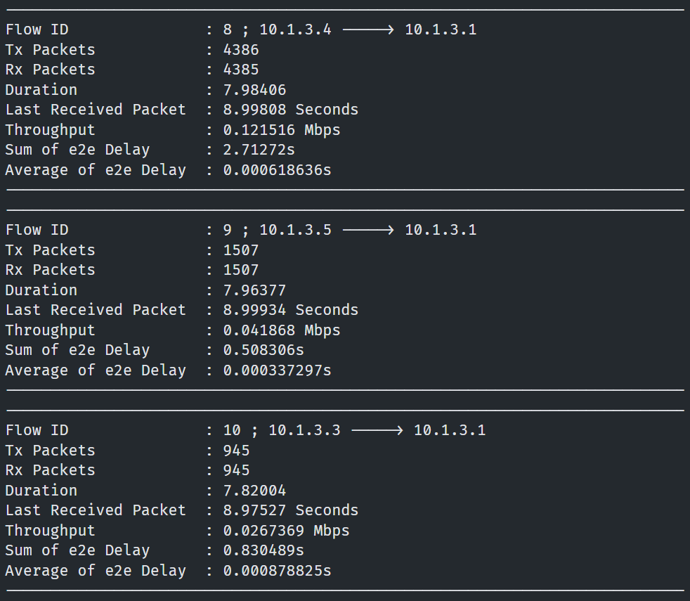
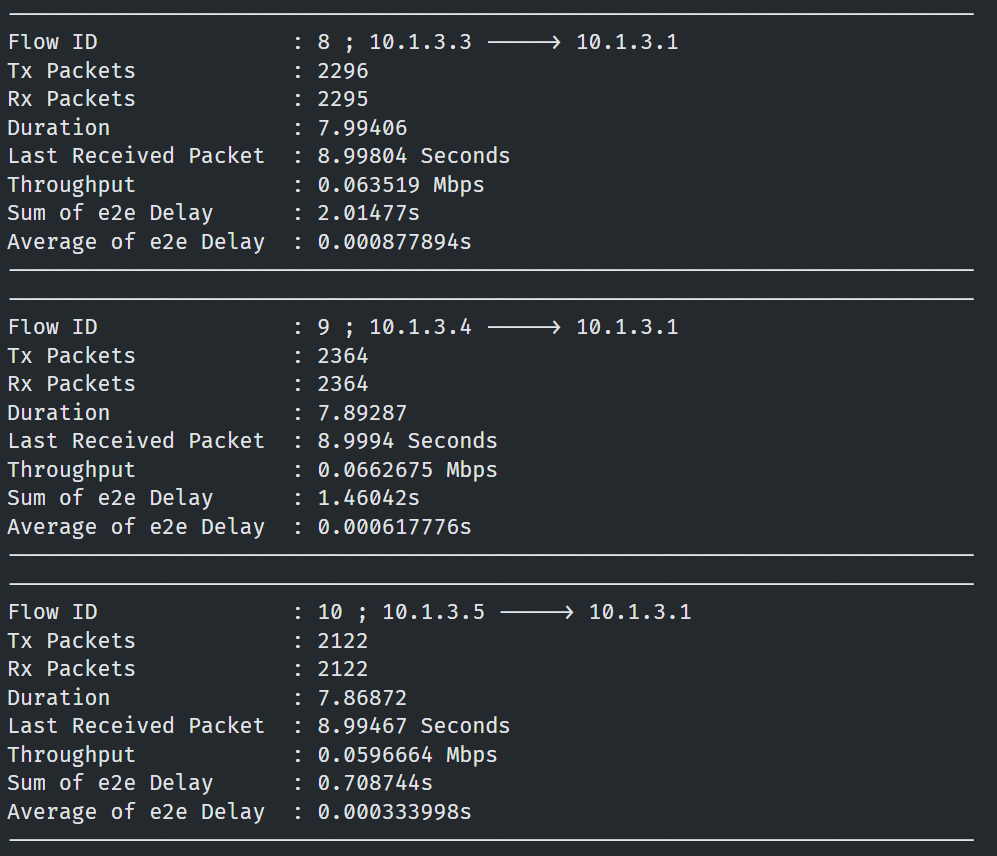
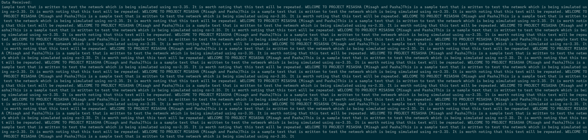

# CN_CHomeworks_2

- [CN\_CHomeworks\_2](#cn_chomeworks_2)
  - [Introduction](#introduction)
  - [Project Description](#project-description)
  - [Definitions](#definitions)
    - [IEEE 802.11](#ieee-80211)
    - [ns-3](#ns-3)
  - [Project Structure](#project-structure)
    - [header.hpp](#headerhpp)
    - [network.hpp](#networkhpp)
    - [constants.hpp](#constantshpp)
    - [client.hpp](#clienthpp)
    - [master.hpp](#masterhpp)
    - [mapper.hpp](#mapperhpp)
    - [utils.hpp](#utilshpp)
  - [ns-3 Simulation](#ns-3-simulation)
    - [Sockets](#sockets)
    - [Accept Callback](#accept-callback)
    - [Receive Callback](#receive-callback)
    - [Simulation](#simulation)
  - [Results](#results)

## Introduction

This is a project for the Computer Networks course at the University of Tehran, Electrical and Computer Engineering department in Spring 2023.  
The project focuses on network simulation and is written in C++.  
The [ns-3](https://www.nsnam.org/) library is used for simulation.

## Project Description

In this project, there are three types of nodes:

- Client Node
- Central Node
- Mapper Node



The **client node** sends data *(which is a number between 0 and 25)* to the central node using a UDP connection.  
The **central node** sends the data to all 3 mappers using a TCP connection.  
The **mapper nodes** each have a map from a number to a character. The 26 numbers are partitioned into the 3 mappers and the numbers that each map are different from the other ones. After mapping, they send the character back to the client using UDP.

## Definitions

### IEEE 802.11

The IEEE 802.11 is a standard for wireless local area networks (WLAN) more commonly known as **Wi-Fi**.  
Some parts of the specification include:

- **MAC** *(Media Access Control)*: Each device is assigned a unique MAC address which is used to identify the device on the network.  
- **PHY** *(Physical Layer)*: The PHY layer of Wi-Fi operates in frequency bands of 2.4GHz or 5GHz. The data transfer rate, channel width, and other physical aspects are also specified.
- **AP** *(Access Points)*: APs are devices that create the wireless network and provide connectivity to other devices.
- **NICs** *(Wireless Network Interface Cards)*: These are the components in a device (such as a PC) that allow communication between a device and an access point.
- **Security**: Some protocols such as WPA2 are used for AP connection authorization and secure data transfer.

Wi-Fi is the most widespread wireless networking standard and many devices support it.

### ns-3

**ns-3** is an open-source discrete-event network simulator.  
ns-3 allows users to build and model network entities (links, nodes, devices, applications), use network protocols (IP, TCP, UDP, Wi-Fi) and simulate them in a customized environment.

## Project Structure

The given sample file has been split into 7 header files:

```text
header.hpp
network.hpp
constants.hpp
client.hpp
master.hpp
mapper.hpp
utils.hpp
```

### header.hpp

Two headers are used.

- `ClientHeader`: This header contains the client ip:port and the 16-bit data.
- `MapperHeader`: This header contains the mapped result of the client's data in *char* format.

### network.hpp

This file contains the `Network` class which specifies and runs the simulation.  
A `NodeContainer` represents a node on the network. There are 3 node types and therefore three of these variables in the class field.  
The `NodeContainer.Create(NUM)` method creates *NUM* instances of the node type.  
Using various helper classes such as `YansWifiChannelHelper`, `YansWifiPhyHelper`, and `WifiMacHelper`, the MAC types are set (`StaWifiMac` for client and mapper, `ApWifiMac` for the server) and then is installed into the nodes' respective `NetDeviceContainer` instances.

An `Ipv4AddressHelper` is used to set the network and host portions of the wanted IP address (this is explained further in **constants.hpp**).  
An `Ipv4InterfaceContainer` represents an IP address. Each node is assigned an IP address using the AddressHelper.  

Now instances of applications (1 client, 1 server, and 3 mappers) are made and ran.  
The simulation begins with all applications starting from the first second and ending after 10 seconds.

### constants.hpp

This file contains constant variables.  
They are separated to different categories with comments.  
Some of the constants are as follows:

- `CLIENT/MASTER_HEADER_LENGTH`: This is the length of the packet headers sent by the client and master.
- `CLIENT/MASTER_PORT`: This is the port used by the client and master.
- `MAPPERS_COUNT` & `MAPPERS_PORTS`: These are the count of mapper nodes and their respective ports.
- `BASE_ADDRESS` & `NET_MASK`: This is used to assign IP addresses to the nodes.
- `RANDOM_DATA`: Sets whether the client should sent random data or `consts::MESSAGE`.
- `SHUFFLE_MAPPINGS`: Use a random mapping.
- `BURSTY_DATA`: Makes the client not wait until `consts::TIMEOUT` to send the next data.
- The options for the grid.

An IP address is made of the network portion and the host portion.  
The network portion determines which network the device belongs to.  
The host portion identifies a specific device on the network.  
The net mask determines the size of the hosts that can be on a network.  
For example, with a net mask of `255.255.255.0`, the first 8 bits is the host portion.

### client.hpp

The client is a simulated application which creates two UDP sockets on start.  
One socket connects to the master and one receives data from mappers.

Data is generated either randomly *(RANDOM_DATA)* or by circularly iterating the given input vector.  
The data is packed into a `ClientHeader` and is sent to the master.

For sending the next data, two modes can be used: bursty or waiting.  
In bursty mode *(BURSTY_DATA)*, the client will send data each `BURSTY_DATA_SEND_INTERVAL` seconds.  
In waiting mode, the client will wait `TIMEOUT` seconds until it receives the mapping result and then sends the next data.

Upon receiving a map result, the character is printed and appended to a string which is printed at the end of the simulation.

### master.hpp

The master application creates 4 sockets:

- 1 UDP socket for receiving the data from the client.
- 3 TCP sockets for sending the data to each mapper.

The TCP sockets forward the same received packet from the UDP socket.

### mapper.hpp

The mapper uses 2 sockets.

- A TCP socket which is listened on to accept incoming master connections and receiving the data.
- A UDP socket to send the mapped data result to the client.

The mapper uses the given map instance to map the received data. If no such entry exists in the map, no action is taken. Else, a UDP socket is created which connects to the ip:port received in the packet header and sends the result.

### utils.hpp

This file contains some helper functions such as `shuffle` and `partitionMappings` which takes a mapping (which is a string with each index being mapped to the character) and partitions it between the number of mappers.

## ns-3 Simulation

Here, some parts of the library are explained:

### Sockets

```cpp
Ptr<Socket> socket = Socket::CreateSocket(GetNode(), TcpSocketFactory::GetTypeId()); // or UdpSocketFactory
```

This creates a UDP/TCP socket.  
The sockets need to be bound to an ip:port. This is done using the `Bind` method:

```cpp
InetSocketAddress addr(ip.GetAddress(0), port);
socket->Bind(addr);
```

We can now `socket->Listen()` (TCP only) or `socket->Connect(addr)` depending on the use case.

The `SetRecvCallback` method is used to handle when something is sent (`socket->Send(packet)`) to the socket:

```cpp
socket->SetRecvCallback(MakeCallback(&Class::HandleRead, this));
```

The application class' `HandleRead` method is called whenever something is received on `socket`.

The `SetAcceptCallback` method is used on a listening socket (TCP) to accept connections and handle them:

```cpp
socket->SetAcceptCallback(MakeNullCallback<bool, Ptr<Socket>, const Address&>(),
                          MakeCallback(&Class::HandleAccept, this));
```

The application class' `HandleAccept` is called whenever someone connects to us.

### Accept Callback

```cpp
void Class::HandleAccept(Ptr<Socket> socket, const Address& from) {
    socket->SetRecvCallback(MakeCallback(&Class::HandleRead, this));
}
```

The accept handler takes the socket to the connector and the address of it as input parameters.  
Here, the receive callback from the accepted socket is set.

### Receive Callback

```cpp
void Class::HandleRead(Ptr<Socket> socket) {
    Ptr<Packet> packet;

    while (packet = socket->Recv()) {
        if (packet->GetSize() == 0) {
            break;
        }

        Header header;
        packet->RemoveHeader(header);

        auto x = header.GetX();
        // ...
    }
}
```

This is how received packets are handled. Wanted data should be in the header and it is extracted from the packet.

### Simulation

First of all, a node is created:

```cpp
NodeContainer node;
node.Create(1);
```

Now we setup the Wi-Fi channel:

```cpp
YansWifiChannelHelper channel;
YansWifiPhyHelper phy;
WifiHelper wifi;

phy.SetChannel(channel.Create());
wifi.SetRemoteStationManager("ns3::AarfWifiManager");
phy.SetErrorRateModel("ns3::YansErrorRateModel");
```

Install wireless devices:

```cpp
WifiMacHelper mac;
NetDeviceContainer nodeDevice;

mac.SetType("ns3::StaWifiMac", "Ssid", SsidValue(ssid), "ActiveProbing", BooleanValue(false));
nodeDevice = wifi.Install(phy, mac, node);
```

Now the node should be placed:

```cpp
MobilityHelper mobility;
mobility.SetPositionAllocator("ns3::GridPositionAllocator",
                               "MinX", DoubleValue(0.0),
                               "MinY", DoubleValue(0.0),
                               "DeltaX", DoubleValue(DELTA_X),
                               "DeltaY", DoubleValue(DELTA_Y),
                               "GridWidth", UintegerValue(GRID_WIDTH),
                               "LayoutType", StringValue("RowFirst"));

mobility.SetMobilityModel("ns3::ConstantPositionMobilityModel");
mobility.Install(node);
```

Install the TCP/IP stack:

```cpp
InternetStackHelper stack;
stack.Install(node);
```

Assign IP addresses:

```cpp
Ipv4AddressHelper addrHelper;
Ipv4InterfaceContainer ipAddr;

addrHelper.SetBase("10.1.3.0", "255.255.255.0"); // Base address & net mask
ipAddr = addrHelper.Assign(nodeDevice);

Ipv4GlobalRoutingHelper::PopulateRoutingTables();
```

Create the applications:

```cpp
Ptr<App> app; // App is a subclass of Application
app = CreateObject<App>(ipAddr, port); // ip and port are passed to the constructor
```

Set application start and stop time:

```cpp
app->SetStartTime(Seconds(0.0));
app->SetStopTime(Seconds(10.0));
```

Set simulator stop time and start the simulation:

```cpp
Simulator::Stop(Seconds(10.0));
Simulator::Run();
```

## Results

The program can be run in multiple modes:

- Data Flow:
  - `Bursty` - The client sends data in bursts.
  - `Timed` - The client waits for the mapping result and then sends the next data.
- Data Generation:
  - `Random` - The client generates random data.
  - `Fixed` - The client iterates the given input vector.
- Mappings:
  - `Normal` - The mapping is done with the exact order of characters in `consts::VALID_CHARACTERS`.
  - `Shuffled` - The mapping is done with a shuffled order of characters in `consts::VALID_CHARACTERS`.

In the `Fixed` mode, the client sends the sequence of data which maps to the following string which is defined in `consts::MESSAGE`:

```text
This is a sample text that is written to test the 
network which is being simulated using ns-3.35. It
is worth noting that this text will be repeated. 
WELCOME TO PROJECT MISASHA (Misagh and Pasha). 
```

The client will print every character it receives from the mapper:



Every 1.0s (`consts::MONITOR_TIME_INTERVAL`), the `DelayAndThroughputMonitor` function is called which prints the delay and throughput of the flows.  

It contains the following parts:

- FlowID
- Source IP
- Destination IP
- Tx Packets (number of packets sent)
- Rx Packets (number of packets received)
- Duration (time elapsed since the first packet was sent)
- Last Received Packet (time of the last received packet)
- Throughput:
  $$Throughput = \frac{Rx Packets\times 8 (bits)}{Duration\times 1024\times 1024}$$
- Sum of e2e delays (sum of delays from the time a packet is sent to the time it is received)
- Average e2e delay (sum of e2e delays divided by the number of received packets)

The result consists of 10 flows which is described as follows (`Timed` and `Fixed` modes are used):

- Flow 1: Client to Master

  

  As we can see, 6848 packets were sent and 6846 packets were received. The throughput is about 0.21 Mbps and it can be calculated as mentioned above. The average delay is about 0.1 ms.

- Flow 2, 3, 4: Master to Mappers

  

  Master has received 6840 packets that should be sent to the mappers. As a result, all 6840 packets are sent to all mappers. The throughput is about 0.35 Mbps for each flow. However, the average delay grows linearly with the number of mappers. This is because the master sends the packet to first mapper and then waits for the acknowledgement. After the acknowledgement is received, the master sends the packet to the second mapper and so on.

- Flow 5, 6, 7: Mappers to Master

  

  Mappers have received 6840 packets and sent 3420 acknowledgements (half of the packets) to the master. The throughput is about 0.17 Mbps for each flow.

- Flow 8, 9, 10: Mappers to Client

  

  Mappers have received 6840 packets. However, each packet is mapped in a single mapper and the other two mappers will just ignore the packet. If the mapper has the mapping for the packet, it will send the mapped data to the client. 6838 packets are sent from the mappers to the client. The problem is that the mapping is not equally partitioned based on the message. As a result, the The number of successfully mapped packets are significantly different for each mapper. The throughput is about 0.12 Mbps for the first mapper. We can fix this by sending a random data:

  

  As we can see, the number of successfully mapped packets are almost the same for each mapper. The throughput 0.06 Mbps for each mapper.

The whole message received by the client in the simulation will also be printed at the end of the simulation:


