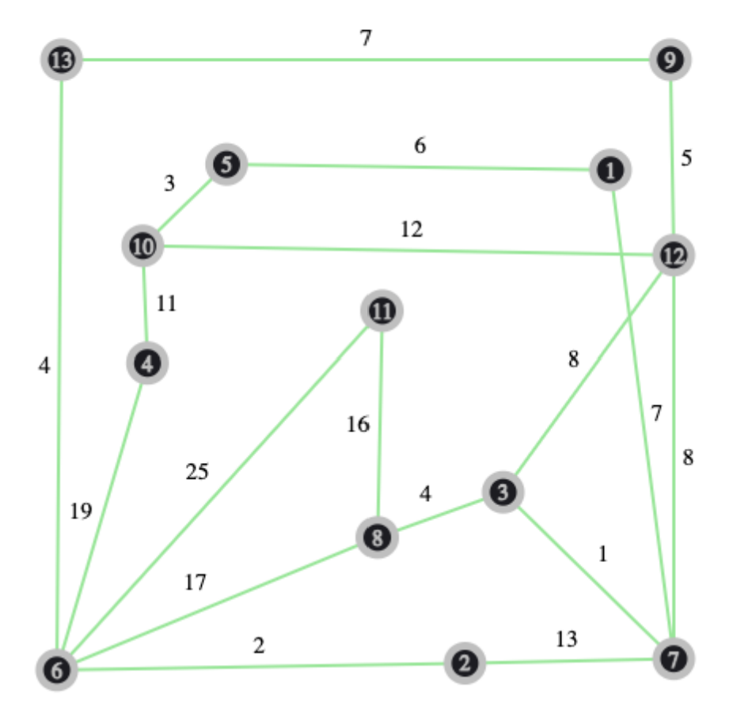
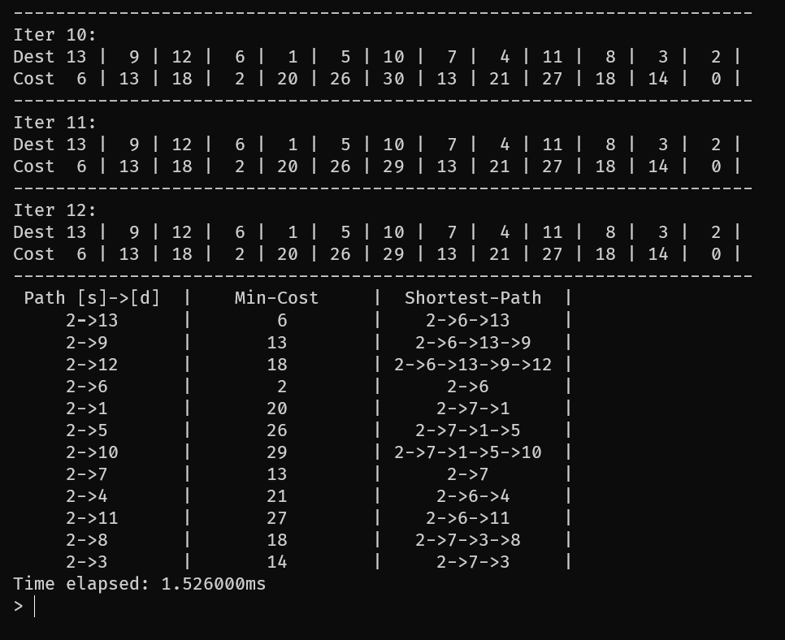
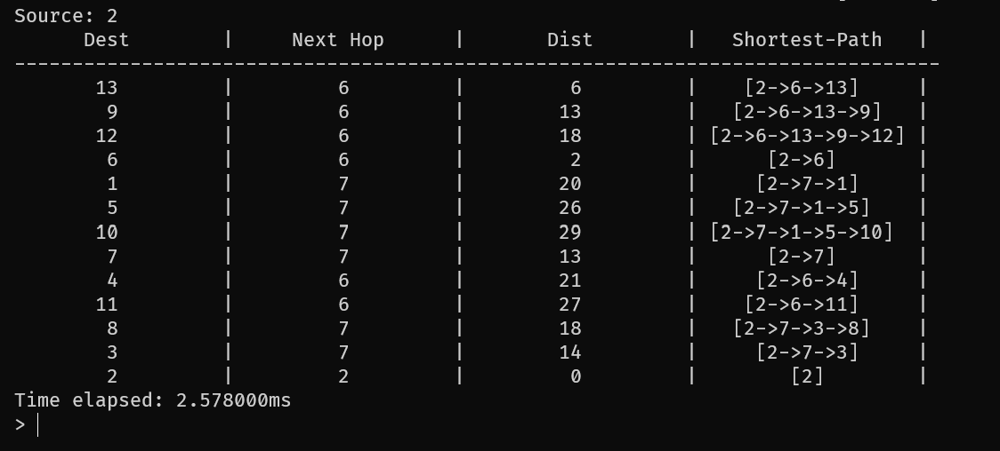
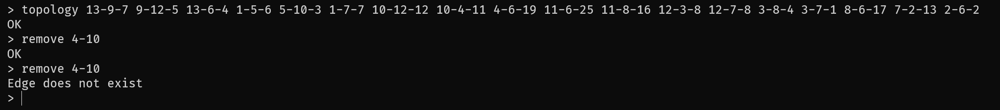
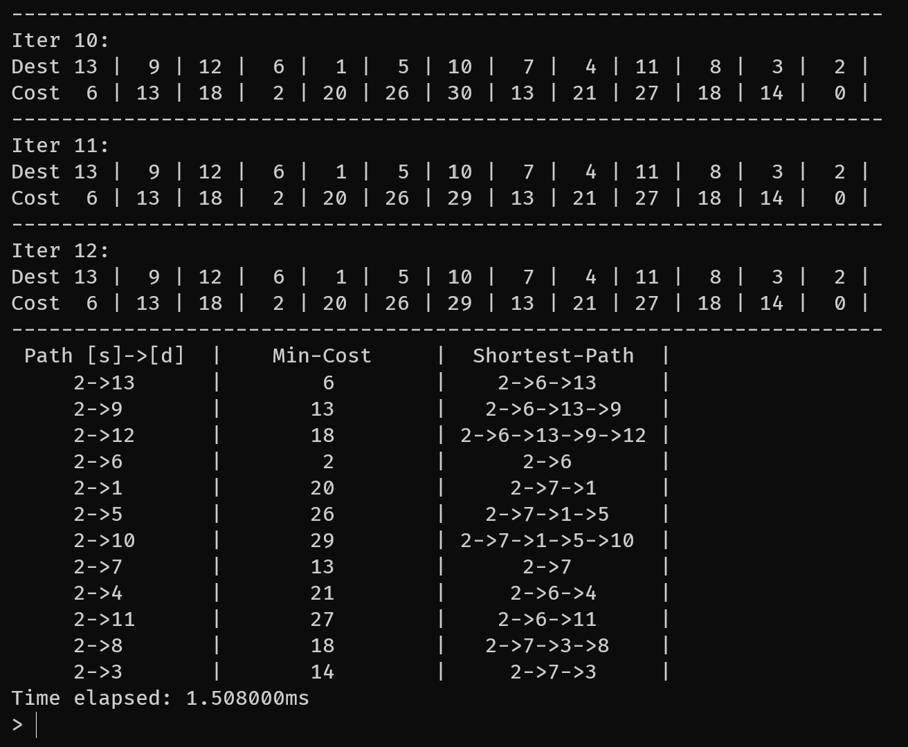
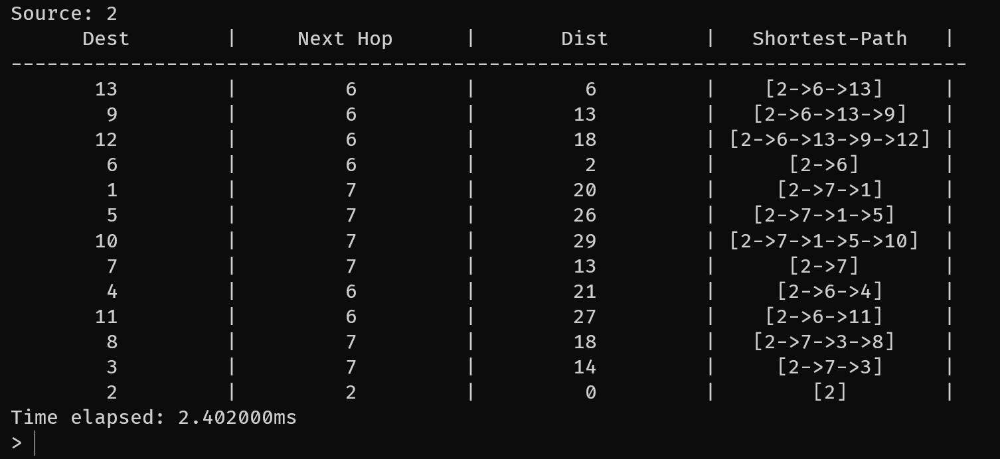

# CN_CHomeworks_3

- [CN\_CHomeworks\_3](#cn_chomeworks_3)
  - [Introduction](#introduction)
  - [Project Description](#project-description)
  - [Definitions](#definitions)
    - [Routing Protocol](#routing-protocol)
    - [Distance-vector](#distance-vector)
    - [Link-state](#link-state)
  - [Project Structure](#project-structure)
    - [command\_line\_interface](#command_line_interface)
    - [node](#node)
    - [network](#network)
      - [getLsrpTable](#getlsrptable)
      - [getDvrpTable](#getdvrptable)
    - [utils](#utils)
  - [Results](#results)

## Introduction

This is a project for the Computer Networks course at the University of Tehran, Electrical and Computer Engineering department in Spring 2023.  
The project focuses on network routing algorithms and is written in C++.

## Project Description

The project uses a command-line interface to define and modify the network graph and link costs.  
After creating the graph, LSRP and DVRP algorithms can be ran on one or all nodes.

```text
Available commands:
  help                   - show this message
  topology [<s>-<d>-<w>] - create a topology
  show                   - show the current topology
  modify <s>-<d>-<w>     - modify the weight of an edge
  remove <s>-<d>         - remove an edge
  lsrp <s>               - run the link state routing protocol
  dvrp <s>               - run the distance vector routing protocol
  exit                   - exit the program
```

## Definitions

### Routing Protocol

A routing protocol used in network packet switching specifies how routers communicate in a distributed way to share information and to find routes between two nodes.

In this project, two Internet routing protocol algorithms are implemented:

- **DVRP** (Distance-Vector Routing Protocol)
- **LSRP** (Link-State Routing Protocol)

The distance-vector algorithm is used in the following routing protocols:

- **RIP** (Routing Information Protocol)
- **EIGRP** (Enhanced Interior Gateway Routing Protocol)

The link-state algorithm is used in the following routing protocols:

- **OSPF** (Open Shortest Path First)
- **IS-IS** (Intermediate System to Intermediate System)

If we think of the network as a graph with link cost representing a graph edge with weight, each node in the two algorithms tries to find the shortest path to the other nodes.

### Distance-vector

This algorithm uses the Bellman-Ford algorithm to calculate the best route.

Here, each node's routing table consists of *(Destination, Cost, Next Hop)*.  
Now every node sends its table to the directly connected neighbors and updates the table based on what it received from the neighbors.  
The algorithm continues until it reaches convergence.  
This process is also what happens in the Bellman-Ford algorithm in which we iterate over every edge of nodes and update their shortest distance list at most N-1 times until convergence.  
There are methods to make the stabilization time faster and to prevent the *count to infinity* problem such as split horizon and split horizon with poison reverse.

The worst time complexity for the algorithm is O(|V||E|) (because we update for each edge at most |V|-1 times).  
If there are N nodes on the network, this is usually O(N^2).

### Link-state

This algorithm uses the Dijkstra's algorithm to calculate the best route.

Here, each node's routing table consists of *(Destination, Cost, Next Hop)* and uses two lists to compute the shortest paths: Confirmed and Tentative.  
Each node will have the link-state advertisement of all other nodes, and can create the network graph using the advertisement information.  
Now every node runs Dijkstra's algorithm to find the shortest path to each node.

The time complexity of the algorithm highly depends on the implementation.  
Using a min-heap which is implemented in this project has a worst-case performance of O(|E|log|V|).  
Using a Fibonacci heap can further improve the time.

## Project Structure

The project is split into the following files:

```text
command_line_interface.hpp/cpp
node.hpp/cpp
network.hpp/cpp
main.cpp
utils.hpp/cpp
```

### command_line_interface

This class takes an instance of `Network`, reads the command from the standard input and executes the corresponding method of `Network`.  
The result of the Network method is then transformed into a human readable text and is printed.

### node

This class represents a node on the network.  
The graph is represented using the adjacency list model.  
Each node has an array of edges:

```cpp
struct Edge {
    Node* destination;
    int weight;
};
```

The edge has a pointer to the node on the other side and its weight.

```cpp
class Node {
public:
    Node(std::string name);
    ~Node();

    const Edge* operator[](const std::string& destination) const;

    bool addEdge(Node* destination, int weight);
    bool removeEdge(Node* destination);
    void modifyEdge(Node* destination, int weight);

    const std::string& getName() const;
    const std::vector<Edge*>& getEdges() const;

private:
    std::string name_;
    std::vector<Edge*> edges_;
};
```

### network

This class contains the network graph and the implementations of the mentioned protocols:

```cpp
class Network {
public:
    Network() = default;
    ~Network();

    Node* operator[](const std::string& name) const;
    Node* operator[](int index) const;

    bool doesNodeExist(const std::string& name) const;
    bool addNode(const std::string& name);
    bool addEdge(const std::string& source, const std::string& destination, int weight);
    bool removeEdge(const std::string& source, const std::string& destination);
    void modifyEdge(const std::string& source, const std::string& destination, int weight);

    const std::vector<Node*>& getNodes() const;
    int getNodeIndex(const std::string& name) const;
    const std::vector<std::vector<int>> getAdjacencyMatrix() const;

    std::vector<std::vector<int>> getLsrpTable(Node* src);
    std::vector<int> getDvrpTable(Node* src);

    std::unordered_map<std::string, std::vector<std::string>> getShortestPaths() const;

private:
    std::vector<Node*> nodes_;
    std::unordered_map<std::string, int> nodeMap_;
    std::unordered_map<Node*, Node*> parent_;
};
```

Edges can be added, removed, or modified (nodes are created if they do not exist).  

#### getLsrpTable

This method returns a `vector<vector<int>>` which is the iteration table of running the Dijkstra's algorithm.  
Each row contains an iteration's values which is the lowest cost to the other nodes.  
If a path does not exist (or is not found yet), the cost will be -1.  
The `parent_` field is used to find the shortest paths after running either algorithm (lsrp or dvrp).

Implementation:

```cpp
std::vector<std::vector<int>> Network::getLsrpTable(Node* src) {
    std::vector<std::vector<int>> iterTable;
    std::unordered_map<Node*, int> distance;
    std::unordered_map<Node*, Node*> parent;
    for (auto& node : nodes_) {
        distance[node] = -1;
        parent[node] = nullptr;
    }

    distance[src] = 0;
    iterTable.push_back(std::vector<int>(nodes_.size(), -1));
    iterTable.back()[nodeMap_[src->getName()]] = 0;

    std::priority_queue<NodeDistance, std::vector<NodeDistance>, std::greater<NodeDistance>> pq;
    pq.push({src, 0});

    while (!pq.empty()) {
        auto top = pq.top();
        pq.pop();
        Node* node = top.destination;
        int dist = top.distance;
        if (dist > distance[node]) {
            continue;
        }

        std::vector<int> currIter = iterTable.back();
        for (auto& edge : node->getEdges()) {
            int newDist = dist + edge->weight;
            if (distance[edge->destination] == -1 || newDist < distance[edge->destination]) {
                distance[edge->destination] = newDist;
                pq.push({edge->destination, newDist});
                parent[edge->destination] = node;
                currIter[nodeMap_[edge->destination->getName()]] = newDist;
            }
        }
        iterTable.push_back(std::move(currIter));
    }

    parent_ = parent;
    iterTable.erase(iterTable.begin());
    if (iterTable.size() > 1 && iterTable.back() == iterTable[iterTable.size() - 2]) {
        iterTable.pop_back();
    }
    return iterTable;
}
```

#### getDvrpTable

This method returns a `vector<int>` which is the lowest cost to the other nodes after running the Bellman-Ford algorithm.  
If a path does not exist, the cost will be -1.  
The `parent_` field is used to find the shortest paths after running either algorithm (lsrp or dvrp).

Implementation:

```cpp
std::vector<int> Network::getDvrpTable(Node* src) {
    std::unordered_map<Node*, int> distance;
    std::unordered_map<Node*, Node*> parent;
    for (auto& node : nodes_) {
        distance[node] = -1;
        parent[node] = nullptr;
    }
    distance[src] = 0;

    for (unsigned i = 0; i < nodes_.size() - 1; ++i) {
        for (auto& node : nodes_) {
            for (auto& edge : node->getEdges()) {
                if (distance[node] == -1) {
                    continue;
                }
                if (distance[edge->destination] == -1 || distance[node] + edge->weight < distance[edge->destination]) {
                    distance[edge->destination] = distance[node] + edge->weight;
                    parent[edge->destination] = node;
                }
            }
        }
    }

    parent_ = parent;
    std::vector<int> costs;
    for (auto& node : nodes_) {
        costs.push_back(distance[node]);
    }
    return costs;
}
```

### utils

This namespace implements some utility functions mostly used for string manipulation such as:

- split
- isNumber
- replicate
- ljust/rjust
- center
- join

## Results

The given sample graph topology is entered into the program and the `lsrp` and `dvrp` commands are ran which will run the algorithms on all nodes.  
The program also times the algorithms so we can check the results.



```text
topology 13-9-7 9-12-5 13-6-4 1-5-6 5-10-3 1-7-7 10-12-12 10-4-11 4-6-19 11-6-25 11-8-16 12-3-8 12-7-8 3-8-4 3-7-1 8-6-17 7-2-13 2-6-2
```

```text
> show
   | 13  9 12  6  1  5 10  7  4 11  8  3  2
--------------------------------------------
13 |  0  7 -1  4 -1 -1 -1 -1 -1 -1 -1 -1 -1
 9 |  7  0  5 -1 -1 -1 -1 -1 -1 -1 -1 -1 -1
12 | -1  5  0 -1 -1 -1 12  8 -1 -1 -1  8 -1
 6 |  4 -1 -1  0 -1 -1 -1 -1 19 25 17 -1  2
 1 | -1 -1 -1 -1  0  6 -1  7 -1 -1 -1 -1 -1
 5 | -1 -1 -1 -1  6  0  3 -1 -1 -1 -1 -1 -1
10 | -1 -1 12 -1 -1  3  0 -1 11 -1 -1 -1 -1
 7 | -1 -1  8 -1  7 -1 -1  0 -1 -1 -1  1 13
 4 | -1 -1 -1 19 -1 -1 11 -1  0 -1 -1 -1 -1
11 | -1 -1 -1 25 -1 -1 -1 -1 -1  0 16 -1 -1
 8 | -1 -1 -1 17 -1 -1 -1 -1 -1 16  0  4 -1
 3 | -1 -1  8 -1 -1 -1 -1  1 -1 -1  4  0 -1
 2 | -1 -1 -1  2 -1 -1 -1 13 -1 -1 -1 -1  0
```

Running `lsrp` gives an average of 1.54ms and running `dvrp` gives an average of 2.44ms.  
This makes sense considering the time complexity of the algorithms.

lsrp:



dvrp:



Now we will remove the 4-10 edge: `remove 4-10`



lsrp:



dvrp:


