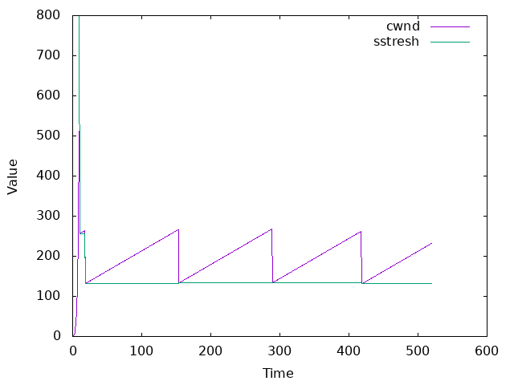
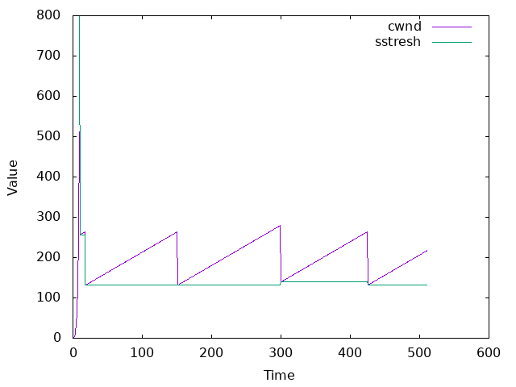
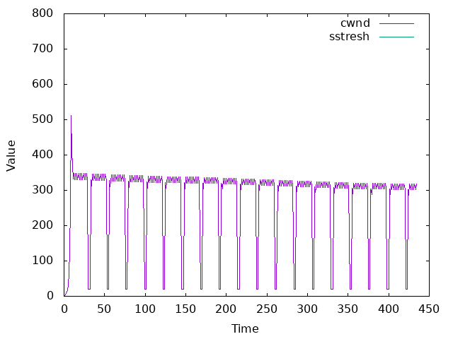

# CN_CHomeworks_4

- [CN\_CHomeworks\_4](#cn_chomeworks_4)
  - [TCP](#tcp)
  - [Congestion Control](#congestion-control)
    - [Congestion Control Algorithms](#congestion-control-algorithms)
      - [TCP Reno](#tcp-reno)
      - [TCP New Reno](#tcp-new-reno)
      - [TCP BBR](#tcp-bbr)
  - [Questions](#questions)
    - [Congestion Control vs Flow Control](#congestion-control-vs-flow-control)
    - [New Reno](#new-reno)
    - [BBR](#bbr)
    - [Difference Between the Three Algorithms](#difference-between-the-three-algorithms)
    - [Result Comparison](#result-comparison)
    - [Other Congestion Control Algorithms](#other-congestion-control-algorithms)

## TCP

TCP is a connection-oriented protocol, which means that a connection is established and maintained until the application programs at each end have finished exchanging messages. It determines how to break application data into packets that networks can deliver, sends packets to and accepts packets from the network layer, manages flow control, and it is meant to provide error-free data transmission—handles retransmission of dropped or garbled packets as well as acknowledgement of all packets that arrive.  

It is a reliable protocol that guarantees the delivery of data to the destination node in the same order as it was sent. TCP uses a sequence number to identify each byte of data. The sequence number identifies the order of the bytes sent from each computer so that the data can be reconstructed in order, regardless of any fragmentation, disordering, or packet loss that may occur during transmission.  

It has the following features compared to UDP:

- Connection-oriented
- Reliable
- Flow control
- Congestion control

## Congestion Control

Congestion control is a mechanism that prevents the congestion of network nodes by limiting the amount of data that can be sent over a network. It is a necessary feature of TCP/IP to avoid network congestion and to ensure reliable data transmission.

### Congestion Control Algorithms

Many congestion control algorithms have been proposed, such as TCP Vegas, TCP Reno, TCP New Reno, CUBIC, and TCP BBR. Here we will introduce the three most common algorithms: TCP Reno, TCP New Reno, and TCP BBR.

#### TCP Reno

TCP Reno adds two mechanisms to TCP to improve performance: fast recovery and fast retransmit.

- Fast retransmit: When a packet is lost, the sender does not have to wait for a timeout to retransmit the packet. Instead, it can retransmit the packet immediately after receiving three duplicate ACKs.
- Fast recovery: When the sender receives three duplicate ACKs, it retransmits the packet that has been lost and removes the slow start phase, which means that the sender does not have to wait for the timeout to retransmit the packet. Instead, it halves the congestion window and enters the congestion avoidance phase.

#### TCP New Reno

TCP New Reno is an improvement of TCP Reno. It adds a mechanism to TCP Reno to improve performance: partial ACK or selective ACK (SACK). Consider the following scenario: the sender sends packets 1, 2, 3, 4, and 5. However, the second packet gets lost and the receiver receives 1, 3, 4, and 5. In this case, the receiver will send an ACK for packet 2 (requests packet 2) three times. However, it specifies a selective ACK for packets 3, 4, and 5. In this case, after entering the fast retransmit mode, TCP will only send packet 2 and continue from packet 6. However, in the previous versions of TCP, it would retransmit all the packets after 2.

#### TCP BBR

TCP BBR (Bottleneck Bandwidth and Round-trip propagation time) is a congestion control algorithm which is developed at Google in 2016. It is a hybrid algorithm that combines the features of TCP Reno and TCP Vegas. It is designed to maximize network throughput and minimize latency at the same time. It is a sender-side only modification to TCP and is a full bandwidth utilization algorithm that can achieve high throughput and low latency at the same time.  

It consists of the following phases:

1. Startup: The congestion window grows exponentially until it reaches the bandwidth-delay product (BDP) of the network.
2. Drain: The congestion window is reduced to the BDP of the network to drain the queue.
3. Probe Bandwidth: The congestion window grows linearly until it reaches the bandwidth of the network.
4. Probe RTT: The congestion window is reduced to the BDP of the network to drain the queue and reduce the RTT.

It is said that TCP BBR can achieve much higher throughput than other algorithms. The following figure shows the comparison between TCP BBR and first versions of TCP:


## Questions

### Congestion Control vs Flow Control

Congestion control is a mechanism that prevents the congestion of network nodes by limiting the amount of data that can be sent over a network. It is a necessary feature of TCP/IP to avoid network congestion and to ensure reliable data transmission.  

Flow control is a mechanism that prevents the receiver from being overwhelmed by data from the sender.

### New Reno

This algorithm is explained in [this section](#tcp-new-reno).

### BBR

This algorithm is explained in [this section](#tcp-bbr).

### Difference Between the Three Algorithms

As mentioned above, `New Reno` is an improvement of `Reno`. Thus, they are similar in many ways. However, `New Reno` has a better performance than `Reno` in many cases because it can selectively retransmit packets and avoid retransmitting the packets that have already been received by the receiver.  

However, `BBR` is a completely different algorithm and it focuses on maximizing the throughput and minimizing the latency at the same time. It is a sender-side only modification to TCP and is a full bandwidth utilization algorithm that can achieve high throughput and low latency at the same time. This is done by probing the bandwidth and RTT of the network and adjusting the congestion window accordingly.

### Result Comparison

As it can be seen in the result section of each algorithm in [this section](#congestion-control-algorithms), `BBR` has a much better performance than `Reno` and `New Reno`. It can achieve a much higher throughput and a much lower latency at the same time. If we compare `Reno` and `New Reno`, we can see that `New Reno` has a better performance than `Reno` in most cases.  

However, we cannot say that one algorithm outperforms the others in all cases as it depends on the network conditions. For example, if the network has a high bandwidth-delay product (BDP), `BBR` will have a better performance than `Reno` and `New Reno`. However, if the network has a low BDP, `Reno` and `New Reno` will have a better performance than `BBR`.

### Other Congestion Control Algorithms

There are many other congestion control algorithms, such as CUBIC, TCP Westwood, and TCP Tahoe. We will introduce them briefly here.

- CUBIC: CUBIC is a newer TCP variant that is designed for high-speed networks with high bandwidth-delay product (BDP). BDP is the product of the link capacity and the round-trip time (RTT), and represents the maximum amount of data that can be in flight without congestion. Cubic uses a cubic function to increase the window size, instead of a linear function like Reno. Cubic is more aggressive than Reno in increasing the window size after a congestion event, and less aggressive than Reno in increasing the window size when the window size is close to the optimal point. Cubic also uses fast retransmit and fast recovery, but with a modified algorithm to avoid spurious timeouts.
- TCP Westwood (TCPW) is a sender-side-only modification to TCP New Reno that is intended to better handle large bandwidth-delay product paths (large pipes), with potential packet loss due to transmission or other errors (leaky pipes), and with dynamic load (dynamic pipes).  
TCP Westwood relies on mining the ACK stream for information to help it better set the congestion control parameters: Slow Start Threshold (ssthresh), and Congestion Window (cwnd). In TCP Westwood, an "Eligible Rate" is estimated and used by the sender to update ssthresh and cwnd upon loss indication, or during its "Agile Probing" phase, a proposed modification to the well-known slow start phase. In addition, a scheme called Persistent Non Congestion Detection (PNCD) has been devised to detect persistent lack of congestion and induce an Agile Probing phase to expeditiously utilize large dynamic bandwidth.
- TCP Tahoe: TCP Tahoe is the first version of TCP. It is a reliable, connection-oriented protocol that guarantees the delivery of data to the destination node in the same order as it was sent. TCP Tahoe uses a sequence number to identify each byte of data. The sequence number identifies the order of the bytes sent from each computer so that the data can be reconstructed in order, regardless of any fragmentation, disordering, or packet loss that may occur during transmission.

If we want to name a congestion control algorithm that outperforms the mentioned algorithms (Reno, New Reno, and BBR), we can name CUBIC. Here are a few reasons why CUBIC is better than the other algorithms:

- Scalability: CUBIC is scalable to high bandwidth-delay product (BDP) networks making it suitable for modern networks.
- Fairness:It achieves fairness by using a concave growth function that controls the congestion window size based on the measured throughput and round-trip time.
- Efficiency: CUBIC optimizes throughput by using a concave growth function that allows it to reach high congestion window sizes quickly without causing excessive packet loss. It adapts to network conditions by estimating the available bandwidth and adjusting its congestion window accordingly, leading to improved utilization of network resources.
- Stability: CUBIC is designed to be stable and avoid unnecessary fluctuations in the congestion window size. It achieves this by utilizing a self-clocking mechanism that reduces congestion window oscillations and helps maintain a stable flow of packets, resulting in a smoother transmission and better overall performance.

## Results

### Reno

```text
RTT, CWND, Threshold
0 1 800
1 2 800
2 4 800
3 8 800
4 16 800
5 32 800
6 64 800
7 128 800
8 256 800
9 512 800
10 256 256
11 257 256
12 258 256
13 259 256
14 260 256
15 261 256
16 262 256
17 263 256
18 264 256
19 132 132
20 133 132
21 134 132
22 135 132
23 136 132
24 137 132
25 138 132
26 139 132
27 140 132
...
508 220 131
509 221 131
510 222 131
511 223 131
512 224 131
513 225 131
514 226 131
515 227 131
516 228 131
517 229 131
518 230 131
519 231 131
520 232 131
```



### New Reno

```text
RTT, CWND, Threshold
0 1 800
1 2 800
2 4 800
3 8 800
4 16 800
5 32 800
6 64 800
7 128 800
8 256 800
9 512 800
10 256 256
11 257 256
12 258 256
13 259 256
14 260 256
15 261 256
16 262 256
17 263 256
18 131 131
19 132 131
20 133 131
21 134 131
22 135 131
23 136 131
24 137 131
25 138 131
...
498 204 131
499 205 131
500 206 131
501 207 131
502 208 131
503 209 131
504 210 131
505 211 131
506 212 131
507 213 131
508 214 131
509 215 131
510 216 131
511 217 131
```

Due to the SACKs, it ends faster.



### BBR

```text
RTT, CWND
0 1
1 2
2 4
3 8
4 16
5 32
6 64
7 128
8 256
9 512
10 409
11 331
12 347
13 329
14 347
15 329
16 347
17 329
18 347
19 329
20 347
21 329
22 347
23 329
24 347
25 329
26 347
27 329
28 347
29 329
30 20
31 20
32 20
33 329
34 312
35 345
36 327
37 345
38 327
...
416 302 800
417 318 800
418 302 800
419 318 800
420 302 800
421 20 800
422 20 800
423 20 800
424 302 800
425 286 800
426 317 800
427 301 800
428 317 800
429 301 800
430 317 800
431 301 800
432 317 800
433 301 800
434 317 800
```


